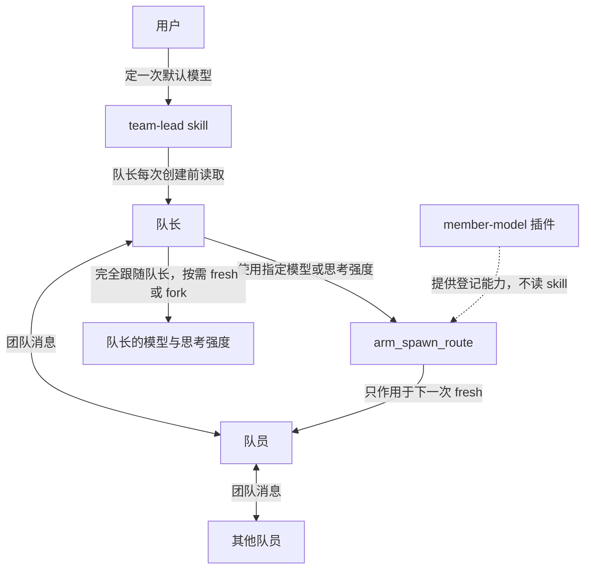

# dsh-team-lead



skill 记住用户选择的默认路由，指导队长主动拆分可独立推进的调查和实现，交代背景、范围与交付，并在执行中持续沟通。它不预设成员模型的能力、速度或价格，而是按任务结构委派，再根据实际交付调整任务范围和说明。插件不带任何人的模型，只提供下一次 fresh spawn 的模型与思考强度覆盖能力。

DeepSeek Harness 的队长用法：`team-lead` skill，外加它依赖的 `member-model` 插件。插件给下一次 fresh spawn 指定模型和思考强度，不带任何人的默认模型。只在 `dsh 0.1.7-rc.1` 上测试过，其他版本会被拒绝。

fork 不受路由登记影响，跟随主模型。插件默认 inherit=true；没有遗留 pending 或配置的 activeDefault 时，不登记的 fresh spawn 也跟随主模型。

## 安装时请 agent 按这个顺序做

用户要求安装本项目时，agent 按下面的步骤执行。仅为解释或审查而读取仓库，不构成安装或组队授权。

1. 把本仓库加进用户正在使用的 profile，并启用 bundle `member-model`。例如：

   ```sh
   dsh plugin --profile <profile> add https://github.com/jwhs648/dsh-team-lead
   ```

   `<profile>` 用用户当前的 profile。装完重启宿主。重启前插件不会生效。

2. 把 `skills/team-lead/SKILL.md` 复制到用户的 skills 目录：

   - Windows: `%USERPROFILE%\.dsh\skills\team-lead\SKILL.md`
   - 其他系统: `~/.dsh/skills/team-lead/SKILL.md`

   发布仓库里的默认路由是空的，不带作者的个人模型。更新已有 skill 时保留用户的默认路由和其他本地定制；无法合并或尚未获准覆盖的冲突，先向用户说明。

3. 尚无用户选择时，确认默认的 provider、model、reasoningEffort，或明确选择跟随队长。使用指定路由时，把答案写进刚复制的 skill 的「默认路由」一节。已有选择和授权就保留，不重复询问。

## 装好之后的行为

- 使用指定路由：每次先 `arm_spawn_route`，再 `spawn_teammate`，`context` 用 `fresh`。显式传入用户设置的思考强度，同模型不同强度也必须登记。
- 完全跟随队长：按是否需要历史选择 fork 或 fresh。fork 不受登记影响；fresh 前应确认没有会覆盖继承的 pending 或 activeDefault。
- 登记只覆盖下一次 fresh spawn，普通子代理也可能消耗它。登记与创建之间不要启动其他 fresh 工作；只有 `armed:true` 才表示本次登记成功，`armed:false` 时先查询并核对当前状态。
- 创建失败后用 `get_spawn_route` 检查可能保留的 pending；放弃、改派或改用 fork 前，用 `clear_spawn_route` 清除旧登记。
- 要用默认路由以外的路由：有用户授权就执行，没有才询问。临时选择不修改默认路由。
- `spawn_teammate` 没有模型参数。

队长什么时候建队员、怎么和队员沟通，以安装后的 `team-lead` skill 为准。本插件不读 skill。

## 取消与失败恢复

`clear_spawn_route({})` 只操作调用者的一次性路由，返回 `{ cleared: boolean, route?: Route }`。实际删除 pending 时为 `cleared:true` 并附已删路由；没有可见 pending 时为 `false`，重复清除不报错。无论是否删到路由，它都会使之前尚未提交的登记和之前创建的失败回滚失效，避免旧路由重新出现。

- 清除不修改配置默认路由，不影响其他 agent，不中止已经开始的创建，也不会把 fork 改成别的模型。
- 未清除、未重新登记时，创建失败（包括中止错误）仍恢复该次路由，方便重试。若不再重试，应显式清除。
- 先前的创建失败不能覆盖更新的路由，也不能在更新的路由已被消费后恢复旧路由。
- `arm_spawn_route` 预检期间发生 clear 或另一登记成功提交时，该次 arm 返回 `{ armed:false, route }`，其中 route 是本次请求的路由，不代表当前 pending。重叠的登记以首个成功提交者为准；顺序调用仍会替换未消费登记。通过 `get_spawn_route` 核对后，按需要重新登记，不要无条件自动重试。
- 清除后 fresh 仍可能使用 `activeDefault`；清除不等于强制跟随队长。省略 reasoningEffort 也不保证重置继承的强度。

新工具必须在宿主加载新版插件后才能使用。仅更新 skill 不会增加工具；更新安装包并按宿主要求重新加载后，再同步新版 skill。

## 包装兼容性与卸载

- 包装安装时实际生效的 `start` 和 `startContinuable` 方法，保留此前第三方包装；accessor 以真实 runtime 为 receiver 读取。透传调用保留 receiver、额外参数、原始请求及解析后的结果 identity。
- 两个入口和工具注册按整体安装：中途失败会回滚已安装部分。支持不可配置但仍可写的数据属性；不可配置 accessor 或不可配置且不可写的数据属性会拒绝安装，不留下半安装。
- 同一 runtime 上重复 apply 整体 no-op 并告警，既不叠加包装，也不重新注册工具或采纳第二份配置。正常卸载后可以重新安装；旧 disposer 重复执行不会拆掉新安装。
- 卸载仅还原仍由本插件持有的方法 descriptor，不覆盖后来安装的第三方包装。后来包装链中残留的旧包装会纯透传；预检途中卸载后，预检成功则透传原请求，预检失败则保留原异常，不恢复旧路由。
- runtime 不可扩展时会告警：安装记录退回模块内 WeakMap，同一模块副本仍能识别重复 apply，但不能保证另一份独立加载的模块副本不会再次包装。不要把同一插件从多个路径重复加载。

## 开发与验证

使用支持内置测试运行器的 Node.js（本轮使用 Node.js 22）：

```sh
npm ci --ignore-scripts --legacy-peer-deps
npm test
```

隔离测试直接导入本项目，通过假 ctx、假 subagent runtime 和可控 Promise 验证工具与路由生命周期；不调用模型、不修改宿主安装包。`--legacy-peer-deps` 用于独立测试安装，避免安装仅在真实宿主运行时需要的 DSH peer dependency。通过这些测试不等于完成宿主端到端验证。

### 本轮验收（2026-09-24）

- Node.js 22、DSH 0.1.7-rc.1：83 项隔离测试通过，覆盖取消、竞态、失败恢复、两个创建入口、包装兼容性与卸载回滚。
- 已在运行中的真实宿主完成 21 项集成检查：工具注册、一次性路由覆盖与消费、fork 保留 pending、幂等清除、清除后继承、真实创建拒绝后的恢复、无效路由预检，以及 continuable 创建与消费。fresh、fork 和 continuable 子代理均返回预期文本，路由由真实子 agent 的 options 核对。
- 实机测试使用用户已授权的本地路由；仓库不携带该个人配置。临时探针仅用于本次验收，不是 npm test 的一部分。并发竞态和第三方包装组合由隔离测试覆盖，不宣称已在全部宿主或插件组合上验证。
