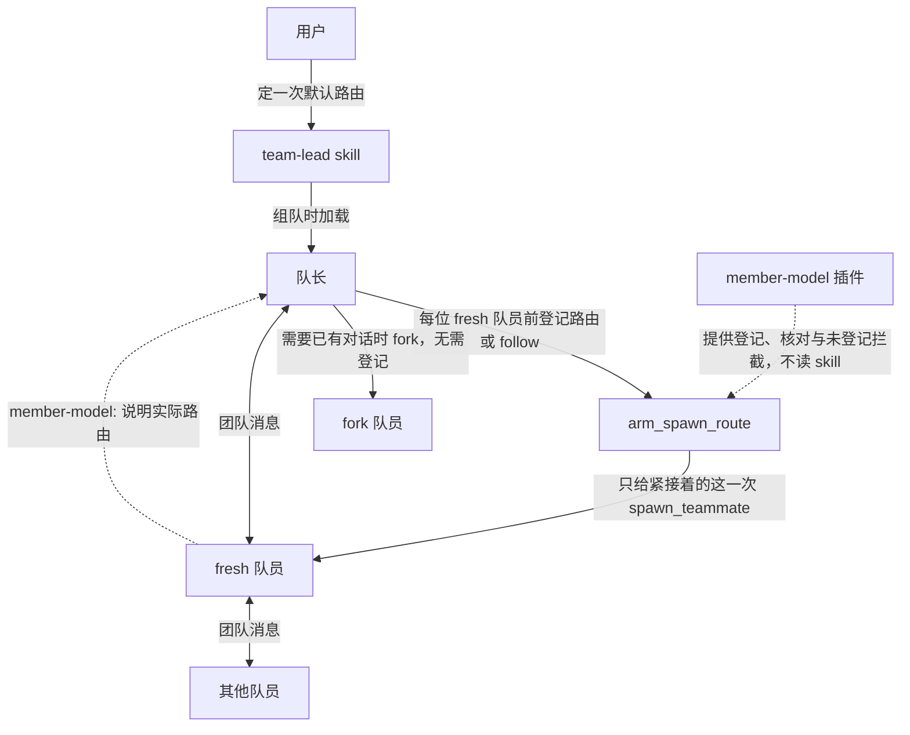

# dsh-team-lead



DeepSeek Harness 的队长用法：`team-lead` skill，外加它依赖的 `member-model` 插件。两者是一个整体：skill 记住用户选择的默认路由，指导队长主动拆分可独立推进的调查和实现，交代背景、范围与交付，并在执行中持续沟通；插件提供队员路由能力，不带任何人的默认模型，也不读 skill。

skill 不预设成员模型的能力、速度或价格，而是按任务结构委派，再根据实际交付调整任务范围和说明。

仅支持已验证的 `dsh 0.1.7-rc.1` 与 `0.1.7-rc.2`，其他版本的安装和启用会被宿主拒绝。新版本的复查方法见「新版 DSH 的兼容复查」。

## 安装时请 agent 按这个顺序做

用户要求安装本项目时，agent 按下面的步骤执行。仅为解释或审查而读取仓库，不构成安装或组队授权。

1. 把本仓库作为 bundle 装进用户正在使用的 profile，并启用 `member-model`：

   - 首选：在 DSH 会话里调用 `plugin_manager`，`action` 为 `install_bundle`，`target` 为 `https://github.com/jwhs648/dsh-team-lead`（要固定版本时，用对应 tag 的 tarball 地址）。该操作需要用户批准。
   - 备选（会话里没有 `plugin_manager` 工具时，这取决于预设）：在 DSH 网页的插件页安装，或用下面的命令：

     ```sh
     dsh plugin --profile <profile> add https://github.com/jwhs648/dsh-team-lead
     ```

     `<profile>` 用用户当前的 profile，装完重启宿主。

   如果 pnpm 报 `ERR_PNPM_UNEXPECTED_STORE`，说明执行命令的 pnpm 与当初安装 profile 的 pnpm 大版本不同（store 不同）。换用同一大版本的 pnpm 再装；需要时只对这一条命令调整 PATH。

   看 `install_bundle` 返回的 `application`：

   - `applied`：已经生效。首次安装、且 profile 支持热加载时会这样。
   - `restart-required`：重启宿主后才生效。升级已安装的 member-model 总是这样：重启前旧版本继续运行，新工具和新行为不会出现。

2. 用刚装好的包里自带的脚本，把同版本的 skill 目录同步到用户的 skills 目录：

   ```sh
   node <已安装的包>/scripts/sync-skill.mjs          # 先预览
   node <已安装的包>/scripts/sync-skill.mjs --write  # 确认后写入
   ```

   - `<已安装的包>` 是 `~/.dsh/profiles/<profile>/node_modules/member-model`（Windows：`%USERPROFILE%\.dsh\profiles\<profile>\node_modules\member-model`）。
   - 目标默认是 `~/.dsh/skills/team-lead/`；设置了 `DSH_HOME` 时在它下面，也可以用 `--target` 指定。
   - 脚本会保留现有副本的三项默认路由。发布包里的默认路由是空的，不带作者的个人模型。
   - 现有副本有模板以外的本地改动时，脚本不覆盖，并列出改动所在的章节。先向用户说明，获准后再加 `--force`；覆盖前会自动备份到 `<skill 目录>/.backup/`。

   只更新 skill 不会增加插件功能。先升级插件并确认已生效，再同步 skill。

3. 尚无用户选择时，确认默认的 provider、model、reasoningEffort，写进刚同步的 skill 的「默认路由」一节。已有选择和授权就保留，不重复询问。用户选择跟随队长时三项留空：三项无法表示「默认跟随」，队长每次组队会再确认一次。

## 怎么开始

在对话里输入 `/team-lead` 加任务描述，例如 `/team-lead 调查并修复登录超时`。这就是明确授权组队，宿主会直接加载 skill。直接说「用智能体团队做……」也可以。

组队前，队长会先确认两件事：当前会话启用了智能体团队，member-model 也可用（1.2.0 或更高）。缺任何一个都会先告诉你，不会让队员静默跟随队长的模型。

## 装好之后的行为（摘要）

- 每位 fresh 队员创建前，队长先登记路由（provider、model、reasoningEffort）或 `{"follow": true}`，再创建。
- 每次创建都会给出一行 `member-model:` 说明，写明队员实际拿到的路由。普通调用时它附在结果末尾；队长在 run_code 里调用时，它作为运行结果之后的一条提示出现。不符时显示 `WARNING`，队长会停下来告诉你。
- 插件在内存里记下每位队长最近 16 位队员的实际路由（`get_spawn_route` 的 `applied`），最终汇报据此列出。
- 没登记的 fresh 创建会被拒绝（`requireArm`，可以关闭）；fork 不受影响，始终跟随队长。
- 登记只给队长紧接着的那一次建队员。workflow 子代理等其他创建不受影响；写明 provider/model 的请求，也不会被插件默认路由改写。
- 三个路由工具只对顶层队长可见。

完整规则见 `skills/team-lead/SKILL.md`（队长怎么分工、交代和验收）和 `skills/team-lead/references/spawn-route.md`（路由细节）。

## 插件配置

| 配置 | 默认 | 说明 |
| --- | --- | --- |
| `inherit` | `true` | `true`：没有登记的 fresh 创建跟随父 agent。`false`：使用下面的 provider/model 作为插件默认路由（activeDefault）。 |
| `provider` / `model` | 空 | 插件默认路由，只在 `inherit: false` 时生效。不会改写写明了 provider/model 的请求。 |
| `reasoningEffort` | 空 | 插件默认路由的思考强度；空表示不设置。 |
| `requireArm` | `true` | 顶层队长未登记、也没有插件默认路由时，拒绝 fresh 队员创建。 |
| `teammateTool` | `spawn_teammate` | 创建队员的工具名，宿主改名时再调整。 |

## 停用与卸载

- **暂时停用**：`plugin_manager` 的 `set_bundle`，`target` 为 `member-model`，`enabled` 为 `false`。profile 支持热加载时立即生效，否则重启后生效。
  - 停用后，三个路由工具消失，`spawn_teammate` 不再被拦截；
  - 队长组队前的前提检查会提示插件不可用。
- **卸载插件**：`plugin_manager` 的 `remove_bundle`，`target` 为 `member-model`。
- **删除 skill**：删除 `~/.dsh/skills/team-lead/` 目录。同步脚本留下的备份在其中的 `.backup/` 里，会一并删除。

## 常见情况

- **队长说插件不可用或版本太旧**：确认当前 profile 装了 member-model 1.2.0 并已启用；升级后要重启过 DSH。
- **看到 `member-model: WARNING …`**：队员的实际路由与授权不符，或者登记没被这次创建用上。队长会停下来说明情况，由你决定下一步，例如调整授权路由或重建队员。
- **队长被 `MEMBER_MODEL_ARM_REQUIRED` 拒绝**：这是防止忘记登记的保护，队长登记后重试即可。不需要时，可以在插件配置里关闭 `requireArm`。
- **同步脚本报「本地改动」**：你改过 skill 的某些章节。先把要保留的改动记下来，确认后再加 `--force`，脚本会先备份。
- **`list_agents` 显示的模型和结果行不一样**：不在运行的队员会显示队长的模型。以结果行和 `get_spawn_route` 的 `applied` 为准。

## 插件细节（维护者）

以下是插件对并发、失败和第三方包装的精确约定，供维护和排查时参考。

### 取消与失败恢复

`clear_spawn_route({})` 只操作调用者自己的一次性登记，返回 `{ cleared: boolean, route?: Route, follow?: true }`。实际删除登记时为 `cleared:true` 并附被删的路由或 `follow:true`；没有可见登记时为 `false`，重复清除不报错。无论是否删到登记，它都会使之前尚未提交的登记和之前创建的失败恢复失效，避免旧路由重新出现。

- 清除不修改插件默认路由，不影响其他 agent，不中止已经开始的创建，也不会把 fork 改成别的模型。
- 未清除、未重新登记时，建队员失败（包括中止错误）会恢复这次登记，方便重试；`member-model:` 说明会写明登记是否还在。不再重试时应显式清除。
- 先前的创建失败不能覆盖更新的登记，也不能在更新的登记已被使用后恢复旧路由。队长 agent 释放时，它的登记、恢复代次和 `applied` 一并清理。
- `arm_spawn_route` 预检期间发生 clear 或另一次登记成功提交时，该次 arm 返回 `{ armed:false, route }`，其中 route 是本次请求的路由，不代表当前登记。重叠的登记以首个成功提交者为准；顺序调用仍会替换未使用的登记。通过 `get_spawn_route` 核对后，按需要重新登记，不要无条件自动重试。
- 清除后，fresh 队员仍可能使用插件默认路由；没有插件默认路由且 `requireArm` 开启时，会被要求重新登记。

### 包装兼容性与卸载

- 包装安装时实际生效的 `start` 和 `startContinuable` 方法，保留此前第三方包装；accessor 以真实 runtime 为 receiver 读取。透传调用保留 receiver、额外参数、原始请求及解析后的结果 identity。
- 两个入口、三个工具和四个事件监听（`tools/execute`、`tools/post-execute`、`agent/created`、`agent/disposed`）按整体安装：任何一步失败都会回滚已装部分。宿主没有事件接口时拒绝安装。支持不可配置但仍可写的数据属性；不可配置 accessor 或不可配置且不可写的数据属性会拒绝安装，不留下半安装。
- 同一 runtime 上重复 apply 整体 no-op 并告警，既不叠加包装，也不重新注册工具或采纳第二份配置。正常卸载后可以重新安装；旧 disposer 重复执行不会拆掉新安装。
- 卸载仅还原仍由本插件持有的方法 descriptor，不覆盖后来安装的第三方包装，并解除对子 agent 的路由工具屏蔽。后来包装链中残留的旧包装会纯透传；预检途中卸载后，预检成功则透传原请求，预检失败则保留原异常，不恢复旧路由。
- runtime 不可扩展时会告警：安装记录退回模块内 WeakMap，同一模块副本仍能识别重复 apply，但不能保证另一份独立加载的模块副本不会再次包装。不要把同一插件从多个路径重复加载。

## 新版 DSH 的兼容复查

peerDependencies 严格固定为已验证版本。DSH 发布新版本后，按下面的顺序复查，全部通过再放宽：

1. 静态检查：

   ```sh
   npm run kernel-check -- <dsh 版本>
   # 等价于 node scripts/kernel-check.mjs <dsh 版本> [--registry <url>] [--proxy <url>]
   ```

   脚本用 `npm pack` 下载与该版本同时发布的内核包，缓存在 `node_modules/.cache/kernel-check/<版本>`，逐项核对：

   - 插件依赖的耦合点：两个创建入口、子 agent 路由合并与委派深度、建队员调用链（且调用本身不带 agentOptions）、`spawn_teammate` 的参数与 provider 选择、工具分发与 post-execute 语义、作用域过滤、agent 事件、工具屏蔽、路由预检、成员视图和插件元数据。
   - skill 依赖的宿主内容：
     - skill 提到的宿主工具仍然存在；
     - skill 交给宿主 team:policy 的规则（target、queued、任务板、等待、共享目录等）仍在；
     - skill 引用的名额、任务权限、等待时长，以及「fork 只继承已完成的轮次」都没有变化；
     - 同一步里的 `arm_spawn_route → spawn_teammate` 仍按顺序逐个执行（两者都是独占调用）；
     - 子 agent 继承的仍是队长最近一次请求头里的路由（插件据此核实跟随），run_code 里子调用的 additionalContexts 仍会转交给运行结果（插件据此送达说明）。

   每项输出 PASS/FAIL 和「文件:行号」证据；有 FAIL 时退出码为 1。

2. 实机验收：按 `scripts/live-checklist.md` 在真实宿主上逐项核对。

3. 都通过后，把新版本加入 `package.json` 的 peerDependencies、`package-lock.json` 和 `tests/compatibility-manifest.test.mjs`。

## 开发与验证

使用 Node.js 20.6 或更高版本：

```sh
npm ci --ignore-scripts --legacy-peer-deps
npm test
```

代码结构：`index.js` 是入口，`lib/` 下按与宿主的耦合点分成 6 个文件，每个文件开头注明对应的 kernel-check 项。kernel-check 报 FAIL 时，据此找到要看的文件。

隔离测试直接导入本项目，用假 ctx、假 subagent runtime、模拟的工具分发（`tools/execute` → 工具本体 → `tools/post-execute`）和可控 Promise 验证路由生命周期；不调用模型、不修改宿主安装包。`--legacy-peer-deps` 用于独立测试安装，避免安装仅在真实宿主运行时需要的 DSH peer dependency。通过这些测试不等于完成宿主端到端验证。

### 1.2.0 验证（2026-09-25）

- 190 项自动化测试通过（Linux 上的 Node.js 20 与 Windows 上的 Node.js 24）：路由生命周期、清除、建队员调用（登记消费、requireArm、结果行与核实）、工具可见性与释放清理、包装兼容性、包元数据、skill 结构与插件/宿主一致性，以及 kernel-check 和 skill 同步脚本的自检。
- kernel-check 对 `0.1.7-rc.1` 与 `0.1.7-rc.2` 均为 21/21 PASS，在 Linux 与 Windows 上都能运行。
- 实机验收（2026-09-25，DSH 0.1.7-rc.2，run_code 模式）：
  - 通过：拦截未登记、按登记创建（同一步成对写）、fork、失败恢复、清除、applied 记录、对队员隐藏路由工具；`/team-lead` 实际组队、交代、验收和按 applied 汇报。
  - 发现并修复两个问题：队长在界面切换模型后，follow 被误报 WARNING；run_code 模式下队长看不到 `member-model:` 说明。
  - 修复后在同一台宿主上复验通过：队长切换到另一个模型后登记 follow，run_code 运行结果之后出现了「与队长当前路由一致、已核实」的说明，队长能看到并转述。

更早版本的验收记录见 `CHANGELOG.md`。
