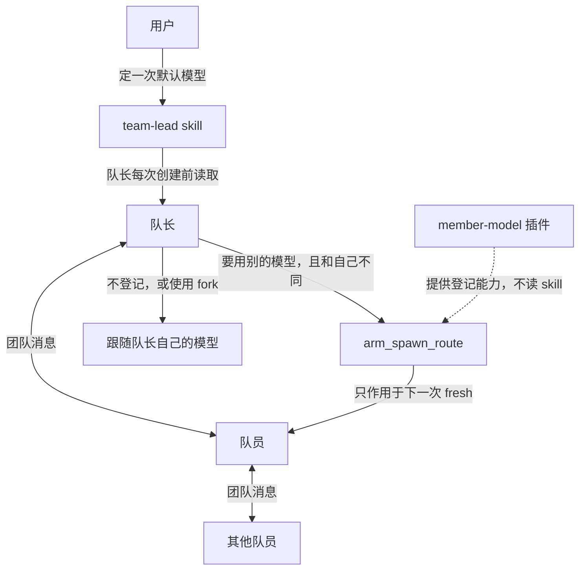

# dsh-team-lead



skill 记住默认模型，并规定什么时候建队员、怎么接着沟通。插件不带任何人的模型，只把下一次 fresh spawn 换成登记过的模型和思考强度。没登记，或者走 fork，就跟随队长。

DeepSeek Harness 的队长用法：`team-lead` skill，外加它依赖的 `member-model` 插件。插件给下一次 fresh spawn 指定模型和思考强度，不带任何人的默认模型。只在 `dsh 0.1.7-rc.1` 上测试过，其他版本会被拒绝。

fork 不受影响，始终跟随主模型。没有登记一次性路由时，fresh spawn 也跟随主模型。

## 安装时请 agent 按这个顺序做

用户通常只会把本仓库链接发给 agent。agent 读到这里就执行，不要只把链接复述回去。

1. 把本仓库加进用户正在使用的 profile，并启用 bundle `member-model`。例如：

   ```sh
   dsh plugin --profile <profile> add https://github.com/jwhs648/dsh-team-lead
   ```

   `<profile>` 用用户当前的 profile。装完重启宿主。重启前插件不会生效。

2. 把 `skills/team-lead/SKILL.md` 复制到用户的 skills 目录：

   - Windows: `%USERPROFILE%\.dsh\skills\team-lead\SKILL.md`
   - 其他系统: `~/.dsh/skills/team-lead/SKILL.md`

   发布仓库里的默认路由是空的。不要用仓库作者自己的模型。如果用户本机已经有自己写好的 `team-lead`，先问要不要覆盖。

3. 问用户一次：默认的 provider、model、reasoningEffort。把答案写进刚复制的那份 skill 的「默认路由」一节。用户没回答之前，不要用非主模型创建队员。

## 装好之后的行为

- 每次 fresh 创建若要使用 skill 里的默认模型，而且它和队长当前模型不同：先 `arm_spawn_route`，再 `spawn_teammate`，`context` 用 `fresh`。一次登记只覆盖紧接着的那一次创建。
- 不登记：fresh 跟随队长。
- 队员要用队长当前模型，并且要接着已有对话：`context` 用 `fork`。不要登记。
- 要用默认路由以外的模型：先问用户。用户同意后只登记那一次。用户没说改默认，就不要改 skill 里的默认路由。
- `spawn_teammate` 没有模型参数。

队长什么时候建队员、怎么和队员沟通，以安装后的 `team-lead` skill 为准。本插件不读 skill。